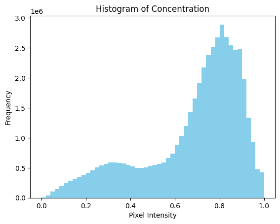

# Mango Leaf diseases classification using Random Forest and Decision Tree

## Dataset: Mangoleaf

Source: https://data.mendeley.com/datasets/hxsnvwty3r/1

## Exploratory Data Analysis

### Histogram of Concentration

### Mean Pixel Intensity by Label

### Box Plot of Pixel Intensities by Label

### Average Pixel Intensities by Each Class

### Principle Component Analysis

